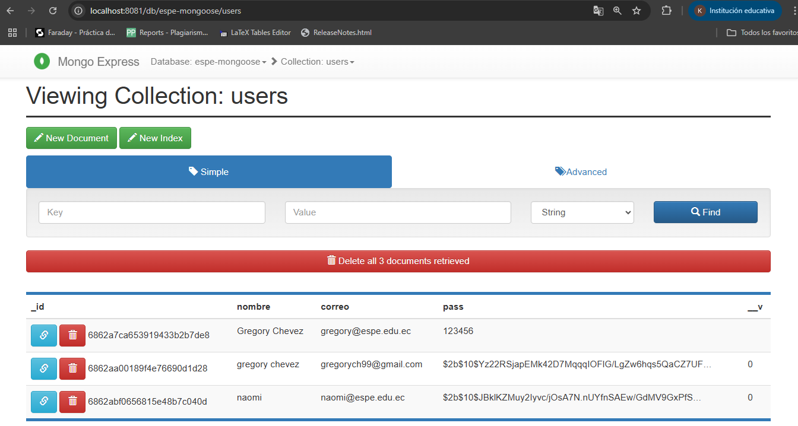

| **DEPARTAMENTO:** Ciencias de la Computación | **CARRERA:** Ingeniería en Tecnologías de la Información |
|----------------------------------------------|----------------------------------------------------------|
| **ASIGNATURA:** Aplicaciones Distribuidas    | **NIVEL:** 7to           | **FECHA:** 28/06/2025     |
| **DOCENTE:** Ing. Paulo Galarza              | **PRÁCTICA N°:** 2       | **CALIFICACIÓN:**         |

**Repositorio GitHub:** [https://github.com/gregoryNa9/Laboratorio1U2/tree/laboratorio2](https://github.com/gregoryNa9/Laboratorio1U2.git)

# Implementación de una API RESTful con Node.js, Express y MongoDB usando Mongoose

**Nombre del estudiante:**  
Karlos Gregory CHevez Bazan

---

## RESUMEN

En esta práctica se desarrolló un sistema completo para la gestión de cursos utilizando una arquitectura basada en servicios. Se implementó una API RESTful con Node.js, Express y MongoDB utilizando Mongoose como ODM. Posteriormente, se creó una aplicación frontend en React encargada de consumir esta API, permitiendo visualizar la información en una interfaz web. Además, se configuraron contenedores Docker para el manejo de la base de datos y su interfaz de administración mongo-express. Todo el flujo fue probado y documentado, desde la creación de recursos hasta su representación gráfica. Esta integración frontend-backend permitió consolidar conocimientos sobre aplicaciones distribuidas.

**Palabras Claves:** API REST, Axios, MongoDB

---

## 1. INTRODUCCIÓN

El objetivo general de este laboratorio fue construir una aplicación distribuida basada en servicios RESTful. Para ello se desarrolló una API que interactúa con MongoDB, y una aplicación frontend en React que realiza las peticiones necesarias para obtener y mostrar los datos. El consumo de la API se realizó utilizando Axios, permitiendo una integración eficiente entre el cliente y el servidor. Esta experiencia permitió aplicar conocimientos tanto de desarrollo backend como de integración frontend, además de fortalecer el uso de herramientas como Docker y Postman.

---

## 2. OBJETIVO(S)

2.1 Implementar un servidor backend con Node.js, Express y MongoDB.  
2.2 Consumir la API desde un cliente web construido en React.  
2.3 Utilizar Axios para realizar peticiones HTTP desde el frontend.  
2.4 Validar el flujo completo de datos con pruebas funcionales y visualización en una interfaz.  

---

## 3. MARCO TEÓRICO

Una API RESTful es una interfaz de comunicación que permite el acceso a recursos mediante métodos HTTP. En este contexto, se emplea Express como framework web minimalista para Node.js, y Mongoose como herramienta para interactuar con MongoDB de forma estructurada, definiendo esquemas y validaciones. En el frontend, React permite construir interfaces reactivas, mientras que Axios facilita la realización de peticiones HTTP. Juntas, estas tecnologías permiten desarrollar aplicaciones completas bajo un enfoque distribuido, en el que el frontend y backend se comunican a través de servicios bien definidos.
Mongoose es un ODM (Object Data Modeling) para MongoDB y Node.js, que facilita la creación de esquemas, validaciones, y consultas estructuradas, mejorando la organización del código y la seguridad. Por su parte, Docker permite encapsular servicios en contenedores, mientras que docker-compose facilita la orquestación de múltiples servicios, como bases de datos y clientes de administración como mongo-express.
Las aplicaciones distribuidas modernas suelen basarse en arquitecturas cliente-servidor, donde el frontend y el backend están desacoplados y se comunican mediante APIs. Una API RESTful (Representational State Transfer) es una interfaz que utiliza los métodos HTTP estándar (GET, POST, PUT, DELETE) para permitir la manipulación y consulta de recursos de manera sencilla, escalable y estandarizada.
En este proyecto, se utilizó:
- **Express.js**: un framework minimalista para Node.js que facilita la creación de servidores web y APIs REST, manejando rutas, middleware y controladores con gran flexibilidad y rendimiento.
- **Mongoose**: una librería ODM (Object Data Modeling) para MongoDB que permite definir esquemas, modelos y validaciones para la base de datos NoSQL, proporcionando una capa de abstracción para interactuar con documentos JSON.
- **MongoDB**: base de datos orientada a documentos, ideal para almacenar datos flexibles y escalables, usada aquí como backend persistente para los cursos.
- **Docker y docker-compose**: herramientas para contenerización que permiten crear entornos aislados y reproducibles, simplificando el despliegue y la gestión de servicios como MongoDB y mongo-express.
- **React**: biblioteca frontend para construir interfaces de usuario reactivas y modulares, utilizando componentes que responden a cambios de estado y eventos de usuario.
- **Axios**: cliente HTTP basado en promesas que facilita la comunicación con la API REST, manejando solicitudes asincrónicas desde el frontend para consumir y modificar recursos.
Esta combinación tecnológica asegura una aplicación con separación clara de responsabilidades, escalabilidad, y mantenibilidad, alineada con prácticas modernas de desarrollo web.

---

---

## 4. DESCRIPCIÓN DEL PROCEDIMIENTO

---
El desarrollo se llevó a cabo en varias fases, siguiendo buenas prácticas para el diseño y la implementación de una API RESTful con un frontend React:

1. **Estructuración del backend:**
   - Se creó una estructura de carpetas clara para organizar el código: `models` para esquemas Mongoose, `controllers` para la lógica de negocio y `routes` para definir las rutas HTTP.
   - Se definió el modelo `Course` en Mongoose, especificando los campos necesarios con sus tipos y validaciones (por ejemplo, nombre, descripción, duración).
   - Se implementaron los endpoints RESTful:  
     - `GET /api/courses`: para obtener la lista de cursos.  
     - `POST /api/courses`: para crear un nuevo curso.  
     - `PUT /api/courses/:id`: para actualizar un curso existente.  
     - `DELETE /api/courses/:id`: para eliminar un curso.  
   - Cada controlador manejó la interacción con MongoDB usando Mongoose, asegurando manejo de errores y respuestas JSON apropiadas.

2. **Configuración de entorno con Docker:**
   - Se configuró un archivo `docker-compose.yml` para levantar un contenedor de MongoDB y otro de `mongo-express` (interfaz web para administración).
   - Se validó que ambos servicios estuvieran activos y accesibles, facilitando la inspección y manipulación directa de la base de datos.

3. **Desarrollo del frontend:**
   - Se creó la aplicación React utilizando `create-react-app` para una configuración inicial rápida y estandarizada.
   - Se implementó un servicio con Axios para encapsular las llamadas HTTP a la API `/api/courses`.
   - Se desarrolló el componente `ListaCursos.js` que:
     - Consume la API para obtener y mostrar la lista de cursos.  
     - Permite crear, actualizar y eliminar cursos desde la interfaz.  
     - Actualiza el estado React para reflejar los cambios sin recargar la página.

4. **Pruebas y validación:**
   - Se usó Postman para probar manualmente los endpoints CRUD, verificando que respondieran correctamente con datos válidos y manejaran errores.
   - Se realizaron pruebas visuales en el navegador, validando la correcta integración y presentación de los datos.
   - Se documentaron los resultados con capturas de pantalla para evidenciar cada operación y su efecto en la base de datos.

---

## 5. ANÁLISIS DE RESULTADOS

Durante el desarrollo y las pruebas, se obtuvieron resultados positivos que confirman la funcionalidad del sistema:

- La comunicación entre el frontend React y la API RESTful a través de Axios fue estable y eficiente, permitiendo un flujo de datos dinámico y en tiempo real.
- La interfaz de usuario muestra correctamente la lista de cursos almacenados en MongoDB y permite realizar operaciones CRUD con retroalimentación inmediata.
- Mongoose facilitó la definición de esquemas y validaciones para garantizar la integridad de los datos en la base.
- Docker permitió el despliegue rápido y aislado de MongoDB y mongo-express, facilitando el control y monitoreo de la base de datos.
- Las pruebas en Postman confirmaron el correcto funcionamiento de los métodos `GET`, `POST`, `PUT` y `DELETE`.

A continuación se presentan evidencias visuales que reflejan y validan cada fase del desarrollo, desde las operaciones realizadas con la API hasta la interacción con la base de datos y la interfaz de usuario.

- `mongo-express.png`, `mongo-express1.png`, `mongo-express2.png`, `mongo-express3.png` y `mongo-express4.png` exhiben la interfaz y la gestión de la base de datos desde mongo-express.
- `login.png` y `register.png` corresponden a las interfaces de autenticación y registro de usuarios.
- `course.png` presenta la vista detallada de un curso en la interfaz React.
- `enterCourse.png` y `insertCourse.png` muestran la creación de cursos mediante Postman.
- `getCourse.png` y `getCourse Post Delete.png` evidencian la consulta de cursos antes y después de eliminar registros.
- `updateCourse.png` muestra la actualización de un curso.
- `deleteCourse.png` ilustra la eliminación de un curso.
- `InsertLab.png` y `BotonIngresoLab.png` muestran el proceso de creación de un laboratorio.
- `InterfazLab.png` representa la interfaz general para la gestión de laboratorios.
- `EditarLab.png` muestra la edición de un laboratorio existente.
- `DeleteLab.png` evidencia la eliminación de un laboratorio.

---
---

## 6. GRÁFICOS O FOTOGRAFÍAS

**Interfaz de login:**  
  

**Registro de usuario:**  
  

**Vista detallada del curso en frontend React:**  
  

**Creación y entrada de cursos por postman:**  
  

**Creación y entrada de cursos por interfaz web:**  
  

**Consulta de cursos (antes y después de eliminación) :**  
  
  

**Actualización de curso por postman:**  
 

**Actualización de curso por interfaz web:**  
 

**Eliminación de curso por postman:**  
  

**Eliminación de curso por interfaz web:**  
  

** Creación de Laboratorio  **
  

** Botón de Ingreso a Laboratorios  **
  

** Interfaz General para Gestión de Laboratorios  **
  

** Edición de Laboratorio  **
  

**Eliminación de Laboratorio  **

**Interfaz general de mongo-express:**  
  

**Vista de la colección `courses` en mongo-express:**  
  

**Detalle de un documento en mongo-express:**  
  

**Vista adicional mongo-express:**  
  

**Vista adicional mongo-express:**  

---

## 7. DISCUSIÓN

La integración de React con un backend en Node.js mediante Axios permitió desarrollar una aplicación web dinámica y funcional, con una arquitectura clara basada en API RESTful. Mongoose facilitó el manejo estructurado de los datos en MongoDB, mientras que herramientas como Postman y mongo-express apoyaron en la validación y visualización del flujo de información. El uso de Docker simplificó el despliegue del entorno, asegurando portabilidad y aislamiento de los servicios. En conjunto, estas tecnologías demostraron ser eficaces para construir aplicaciones distribuidas modernas, aplicando buenas prácticas de desarrollo web.

---

---

## 8. CONCLUSIONES

- La arquitectura cliente-servidor implementada con API RESTful permitió una comunicación fluida y eficiente entre el frontend en React y el backend en Node.js, garantizando una experiencia de usuario dinámica.
- El uso combinado de Mongoose y MongoDB facilitó la definición, validación y persistencia estructurada de los datos, asegurando integridad y coherencia en las operaciones CRUD.
- La integración de Docker simplificó significativamente la configuración y despliegue de los servicios, demostrando la utilidad de entornos aislados para el desarrollo y pruebas de sistemas distribuidos.

---

## 9. BIBLIOGRAFÍA

- MongoDB, Inc. (2024). [MongoDB Manual](https://docs.mongodb.com/). Consulta: 28/06/2025.  
- Express.js Foundation. (2024). [Express Documentation](https://expressjs.com/). Consulta: 28/06/2025.  
- Automattic. (2024). [Mongoose Documentation](https://mongoosejs.com/docs/). Consulta: 28/06/2025.  
- Meta Platforms, Inc. (2024). [React Documentation](https://reactjs.org/docs/getting-started.html). Consulta: 28/06/2025.  
- Axios (2024). [Axios GitHub](https://github.com/axios/axios). Consulta: 28/06/2025.